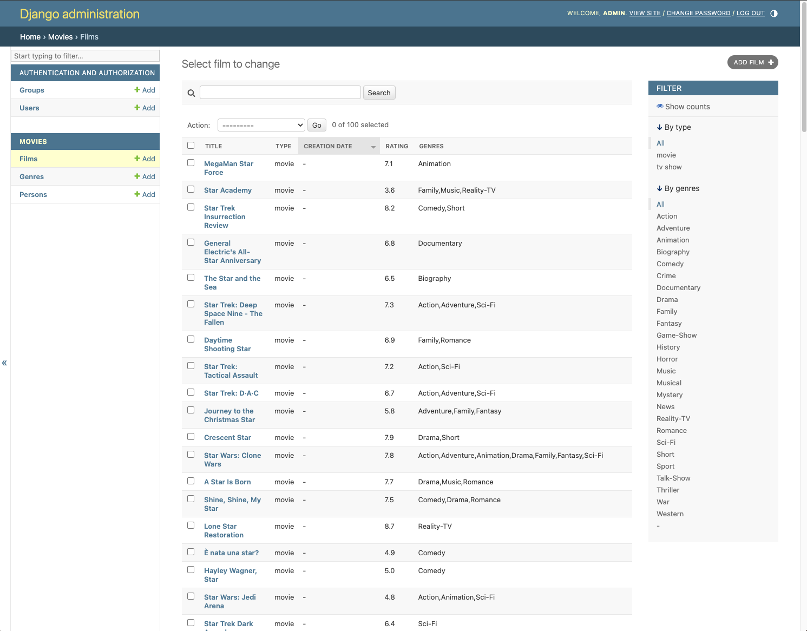

README: Запуск Docker Compose для приложения

Шаг 1: Подготовка файлов и окружения

    Перейдите в папку проекта:

cd docker_compose/simple_project

Создайте файл .env:

    Используйте шаблон .env.demo как основу:

cp .env.demo .env

Откройте файл .env и заполните необходимую информацию, например:

Подготовьте дамп базы данных:

    Убедитесь, что файл с дампом базы данных существует по пути:

        docker_compose/simple_project/database_dump.sql

        Этот файл будет использоваться для инициализации базы данных.

Шаг 2: Запуск проекта

    Выполните следующую команду для запуска контейнеров:

docker compose up --build

Важно: Выполняйте эту команду из папки, где находится docker-compose.yml, то есть:

docker_compose/simple_project

Дождитесь, пока все сервисы будут запущены.

---------------------------
Этот проект представляет собой систему из трех основных сервисов: Django-приложение, PostgreSQL база данных и Nginx сервер для обработки запросов и отдачи статических/медиа файлов.
Состав сервисов
1. app: Django-приложение

    Роль: Основное приложение, обрабатывающее бизнес-логику.
    Dockerfile: Содержит инструкции для сборки контейнера с Django-приложением.
    Порты:
        Приложение доступно по http://localhost:8000.
    Монтируемые тома:
        ./data/static → /opt/app/staticfiles: для хранения собранных статических файлов.
        ./data/media → /opt/app/media: для хранения загруженных медиа-файлов.
        ./data/logs → /var/log: для хранения логов.
    Переменные окружения: Загружаются из файла .env.
    Сеть:
        Использует сети db_network и web_network.
    Зависимости:
        Запускается после сервиса базы данных db.

2. nginx: Nginx веб-сервер

    Роль: Обрабатывает HTTP-запросы, проксирует их к Django-приложению и раздаёт статические/медиа файлы.
    Образ: nginx:latest.
    Порты:
        Доступен по http://localhost:80.
    Монтируемые тома:
        ./nginx.conf → /etc/nginx/nginx.conf: основной конфиг Nginx.
        ./configs → /etc/nginx/conf.d: дополнительные конфигурации.
        ./data/static → /var/www/static: папка для статики.
        ./data/media → /var/www/media: папка для медиа-файлов.
    Сеть:
        Использует сеть web_network.
    Зависимости:
        Запускается после сервиса app.

3. db: PostgreSQL база данных

    Роль: Хранение данных приложения.
    Образ: postgres:15.
    Монтируемые тома:
        ./database_dump.sql → /docker-entrypoint-initdb.d/init.sql: скрипт для инициализации базы данных.
        ./postgres_data → /var/lib/postgresql/data: данные базы.
    Переменные окружения:
        Загружаются из файла .env.
    Сеть:
        Использует сеть db_network.

----------------------

# Проектное задание: Docker-compose

Приступим к улучшению сервиса в области DevOps. Настройте запуск всех компонентов системы — Django, Nginx и Postgresql — с использованием docker-compose.

Для упрощения выполнения задания мы подготовили проект, где настроена работа связки Django + uWSGI + Nginx + Docker. Вы его найдете в своем репозитории в папке `docker_compose/simple_project`.

Сама заготовка уже показывает админку. Однако статика не собирается, миграций нет, конфиги Nginx, uWSGI и Docker, возможно, придётся подправить.

Если вы считаете, что всё нужно сделать по-другому, смело меняйте структуру проекта.

**Перед сдачей проекта на ревью, убедитесь, что выполнены все нижеперечисленные шаги:**

- Отредактируйте, при необходимости, файл `docker_compose/simple_project/app/Dockerfile` для Django. В нем, как минимум, можно добавить сбор статики перед запуском контейнера `python manage.py collectstatic --no-input`. Так же можно продумать создание суперпользователи или даже применение миграций.
- Для настройки Nginx можно пользоваться наработками из этой темы, но ревьюеры будут запускать ваше решение. Перед сдачей проекта убедитесь, что всё работает правильно.
- Уберите версию Nginx из заголовков. Версии любого ПО лучше скрывать от посторонних глаз, чтобы вашу админку случайно не взломали. Найдите необходимую настройку в официальной документации и проверьте, что она работает корректно. Убедиться в этом можно с помощью «Инструментов разработчика» в браузере.
- Отдавайте статические файлы Django через Nginx, чтобы не нагружать сервис дополнительными запросами. Перепишите `location` таким образом, чтобы запросы на `/admin` шли без поиска статического контента. То есть, минуя директиву `try_files $uri @backend;`.
- Обратите внимание на следующее: сбор статики происходит в контейнере с Django приложением, а отдавать ее будет Nginx. Это значит, что Nginx должен каким-то образом получить доступ к этим файлам. Мы вам рекомендуем использовать секцию `volumes` для совместного доступа обоих сервисов к этим файлам.
- В `docker-compose.yml` обратите внимание на инструкцию `- ./database_dump.sql:/docker-entrypoint-initdb.d/init.sql` в сервисе `theatre-db`. Таким образом мы заливаем дамп базы данных в postgres. Это необходимо для наглядности, дабы в административной панели не было пусто. Вы можете убрать эту строку, если хотите создать пустую админку. 
- Важно! Сервис `theatre-db` в текущем виде работать не будет. Это база данных PostgreSQL и полное ее описание остается за вами.
- Проверьте себя. После запуска `docker compose up -d` приложение должно быть доступно в браузере по адресу `http://localhost/admin/`, для входа используйте логин `admin` и пароль `123123` (если вы заливаете database_dump.sql в базу данных, в противном случае, вам необходимо создать суперпользователя самостоятельно). Результат должен выглядеть следующим образом:

Если ваш результат выглядит так же, поздравляем, вы справились 🎉

**Подсказки и советы:**

- Теории должно быть достаточно для понимания принципов конфигурирования. Если у вас появятся какие-то вопросы по параметрам, ищите ответы [в официальной документации](https://nginx.org/ru/){target="_blank"}.
- Для выполнения задачи про `/admin` нужно посмотреть порядок поиска `location`.
- Для работы со статикой нужно подумать, как залить данные в файловую систему контейнера с Nginx.
- Для задания дана базовая структура, которой можно пользоваться.
- При настройке docker-compose важно проверять пути до папок. Большинство проблем связанно именно с этим.

